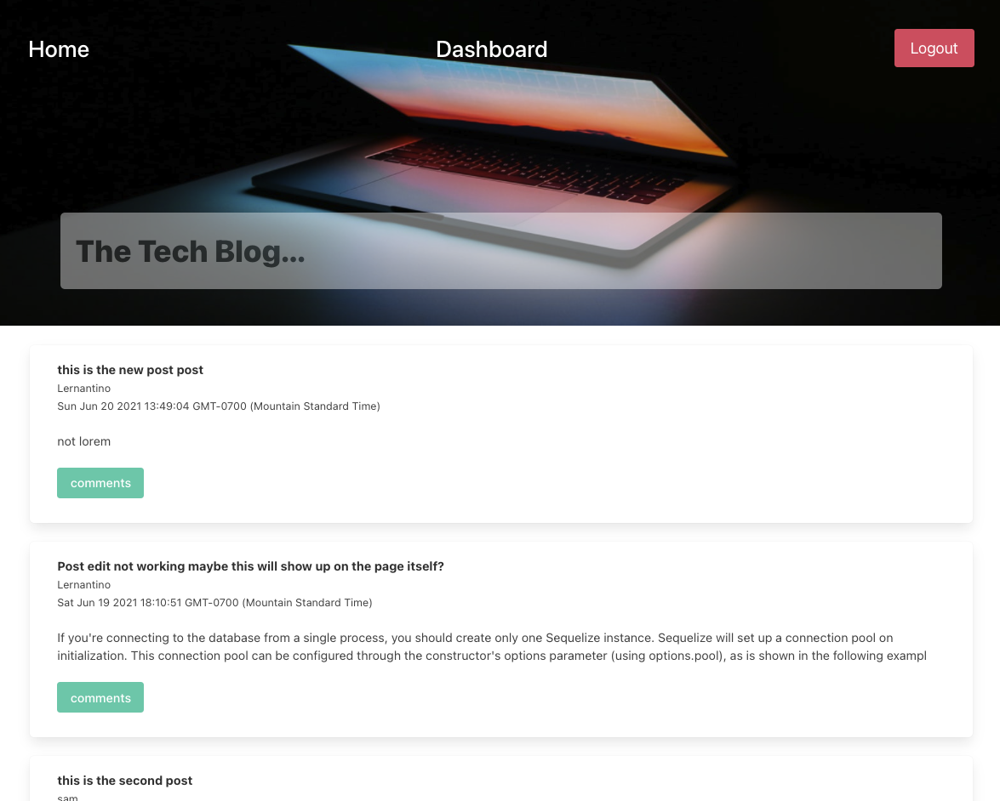

# tech-blog

## Github link 
https://github.com/Wsamuell/tech-blog

## Heroku link 
https://sammie-tech-blog.herokuapp.com/

## Description 
A CMS-style blog site similar to a Wordpress site, where developers can publish their blog posts and comment on other developers’ posts as well.

## Screenshot Images

### User Story
* AS A developer who writes about tech
* I WANT a CMS-style blog site
* SO THAT I can publish articles, blog posts, and my thoughts and opinions

### Built with
* [Handlebars.js](Handlebars Js) - Front-end Framework
* [https://expressjs.com/](Express.js) - Node Framework
* [https://dashboard.heroku.com/](Heroku) - Backend 
* [https://dev.mysql.com/](MySQL) - Backend Database
